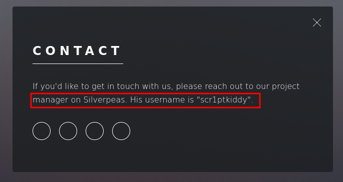
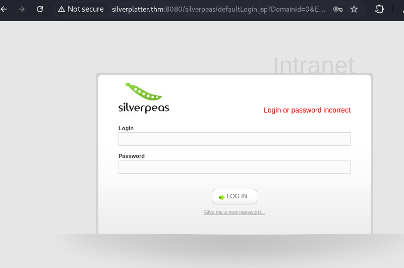
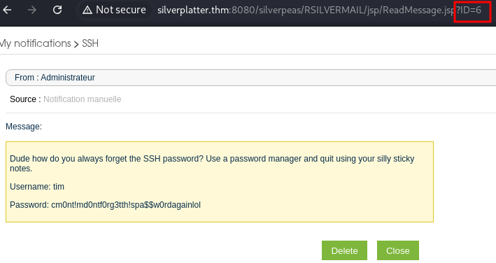

# Silver Platter (THM)

# Enumeration

## Nmap

```bash
PORT     STATE SERVICE    REASON         VERSION

22/tcp   open  ssh        syn-ack ttl 63 OpenSSH 8.9p1 Ubuntu 3ubuntu0.4 (Ubuntu Linux; protocol 2.0)
| ssh-hostkey:
|   256 1b:1c:87:8a:fe:34:16:c9:f7:82:37:2b:10:8f:8b:f1 (ECDSA)
| ecdsa-sha2-nistp256 AAAAE2VjZHNhLXNoYTItbmlzdHAyNTYAAAAIbmlzdHAyNTYAAABBBJ0ia1tcuNvK0lfuy3Ep2dsElFfxouO3VghX5Rltu77M33pFvTeCn9t5A8NReq3felAqPi+p+/0eRRfYuaeHRT4=
|   256 26:6d:17:ed:83:9e:4f:2d:f6:cd:53:17:c8:80:3d:09 (ED25519)
|_ssh-ed25519 AAAAC3NzaC1lZDI1NTE5AAAAIKecigNtiy6tW5ojXM3xQkbtTOwK+vqvMoJZnIxVowju

80/tcp   open  http       syn-ack ttl 63 nginx 1.18.0 (Ubuntu)
|_http-title: Hack Smarter Security
|_http-server-header: nginx/1.18.0 (Ubuntu)
| http-methods:
|_  Supported Methods: GET HEAD

8080/tcp open  http-proxy syn-ack ttl 62
|_http-title: Error
| fingerprint-strings:
|   FourOhFourRequest, GetRequest, HTTPOptions:
|     HTTP/1.1 404 Not Found
|     Connection: close
|     Content-Length: 74
|     Content-Type: text/html
|     Date: Tue, 08 Apr 2025 12:10:59 GMT
|     <html><head><title>Error</title></head><body>404 - Not Found</body></html>

```

## SSH(22)

```bash
ross㉿kali)-[~/thm/silverplatter]
└─$ ssh root@silverplatter.thm
The authenticity of host 'silverplatter.thm (10.10.52.56)' can't be established.
ED25519 key fingerprint is SHA256:WFcHcO+oxUb2E/NaonaHAgqSK3bp9FP8hsg5z2pkhuE.
This key is not known by any other names.
Are you sure you want to continue connecting (yes/no/[fingerprint])? y
Please type 'yes', 'no' or the fingerprint: yes
Warning: Permanently added 'silverplatter.thm' (ED25519) to the list of known hosts.
root@silverplatter.thm's password:

```

-   SSH uses password based Auth
-   since we have gotten the user name and password from the oops by the admin we have gained SSH


## HTTP(80)

### Dirsearch

```bash
Target: http://silverplatter.thm/

[13:47:37] Starting:
[13:47:49] 301 -  178B  - /assets  ->  http://silverplatter.thm/assets/
[13:47:49] 403 -  564B  - /assets/
[13:47:58] 301 -  178B  - /images  ->  http://silverplatter.thm/images/
[13:47:58] 403 -  564B  - /images/
[13:48:01] 200 -   17KB - /LICENSE.txt
[13:48:09] 200 -  771B  - /README.txt

```

### Vhosts

```bash
: Method           : GET
 :: URL              : http://silverplatter.thm
 :: Wordlist         : FUZZ: /usr/share/wordlists/dirbuster/directory-list-2.3-medium.txt
 :: Header           : Host: FUZZ.silverplatter.thm
 :: Header           : User-Agent: PENTEST
 :: Follow redirects : false
 :: Calibration      : false
 :: Timeout          : 10
 :: Threads          : 40
 :: Matcher          : Response status: 200-299,301,302,307,401,403,405,500
 :: Filter           : Response size: 14124
________________________________________________

:: Progress: [220560/220560] :: Job [1/1] :: 1769 req/sec :: Duration: [0:02:11] :: Errors: 0 ::

```

-   nothing was found with FF

## Website Features



-   Software Information: Silverpeas
-   Username Enumeration: scr1ptkiddy

## HTTP(8080)




-   using burp suite we was able to create a custom password list using cewl to find out his password was adipiscing

### we web crawled the site using the syntax below to create a custom password list

```jsx
cewl http://silverplatter.thm > custom_passwords.txt
```



-   oops looks like we could change the id of the notifications and the admin shares ssh password

```bash
Username: tim
Password: cm0nt!md0ntf0rg3tth!spa$$w0rdagainlol
```

# Post-Exploitation

## No sudo Privileges 😢

```bash
tim@silver-platter:~$ sudo -l
[sudo] password for tim:
Sorry, user tim may not run sudo on silver-platter.

```

## interesting Group - ADM

```bash
tim@silver-platter:~$ id
uid=1001(tim) gid=1001(tim) groups=1001(tim),4(adm)

```

## Users

-   There is another user name `tyler` on the machine

```bash
tim@silver-platter:~$ id
uid=1001(tim) gid=1001(tim) groups=1001(tim),4(adm)

```


## after finding this information we cd over to `/var/log/` and then grep out for passwords

```bash
grep -ir "password"
```

## this then shows us silverpeas starting up and using a password of `_Zd_zx7N823/`

```bash

auth.log.2:Dec 13 15:44:30 silver-platter sudo:    tyler : TTY=tty1 ; PWD=/ ; USER=root ; COMMAND=/usr/bin/docker run --name silverpeas -p 8080:8000 -d -e DB_NAME=Silverpeas -e DB_USER=silverpeas -e DB_PASSWORD= _Zd_zx7N823/ -v silverpeas-log:/opt/silverpeas/log -v silverpeas-data:/opt/silvepeas/data --link postgresql:database sivlerpeas:silverpeas-6.3.1
auth.log.2:Dec 13 15:45:21 silver-platter sudo:    tyler : TTY=tty1 ; PWD=/ ; USER=root ; COMMAND=/usr/bin/docker run --name silverpeas -p 8080:8000 -d -e DB_NAME=Silverpeas -e DB_USER=silverpeas -e DB_PASSWORD=_Zd_zx7N823/ -v silverpeas-log:/opt/silverpeas/log -v silverpeas-data:/opt/silvepeas/data --link postgresql:database silverpeas:silverpeas-6.3.1
auth.log.2:Dec 13 15:45:57 silver-platter sudo:    tyler : TTY=tty1 ; PWD=/ ; USER=root ; COMMAND=/usr/bin/docker run --name silverpeas -p 8080:8000 -d -e DB_NAME=Silverpeas -e DB_USER=silverpeas -e DB_PASSWORD=_Zd_zx7N823/ -v silverpeas-log:/opt/silverpeas/log -v silverpeas-data:/opt/silvepeas/data --link postgresql:database silverpeas:6.3.1

```

## Knowing this we check for password reuse and Tyler is still using the same password allowing us to again access to his account

```bash
tyler@silver-platter:/$ sudo -l
Matching Defaults entries for tyler on silver-platter:
    env_reset, mail_badpass, secure_path=/usr/local/sbin\:/usr/local/bin\:/usr/sbin\:/usr/bin\:/sbin\:/bin\:/snap/bin, use_pty

User tyler may run the following commands on silver-platter:
    (ALL : ALL) ALL

```

## From Tyler we run sudo -l to see what we can do and Tyler can do all sudo allowing us to just change user to root

```bash
root@silver-platter:/# whoami
root

```


